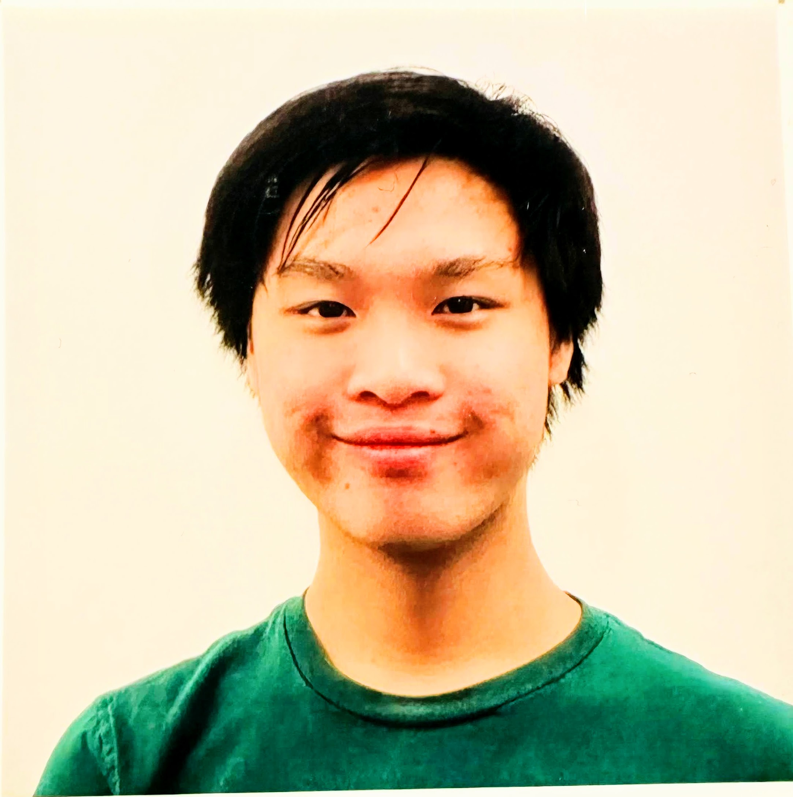

## Our Mission

Last Mile Now is a non-profit tech and crowd-funding community that focuses on accessibility issues in areas such as healthcare, education, climate, LGBTQ & Food Security.  

There are plenty of resources and information online in eah areas, but finding the right information at the right time might be challanging due to factors such as language, education, habit.  We want to help people find the right information and benefit from them through chatbots, open-source projects, open data. 

We believe a personalized chatbot that understand individual's need can.  We are committed to use technologies such as AI, chatbots, text messages and social media such as instagram, to provide an information delivery platform.

## How We Deliver

In short, through working on open source projects that help the causes, and fund raising to sponsor the open source projects we think will further the causes. 

Committees are set up in each area and each committee will have monthly and querterly meetins to discuss the open source projects to work on, or to sponsor. Fund raising events will also be discussed in each committee meeting.  

## Our Team

| --- | --- |
| |  |
[Darren Weng](https://www.darrenweng.com) Co-Founder and Business Development |[Gabriel Weng](https://www.gabrielweng.com)  Co-Founder and Tech Lead |